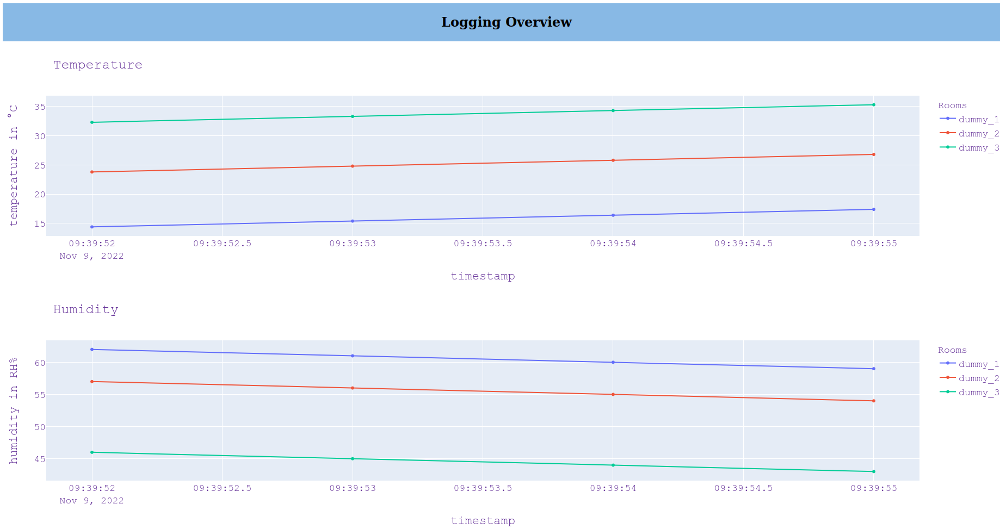

# Description

This is a project for lightweight temperature tracking. It includes code for micropython (https://micropython.org/) which reads temperature and humidity from a DHT11 sensor every 10min and transmits it to the server which renders the measurements in two plotly plots. The microcontroller code is tailored towards ESP-8266 where the device goes into deep sleep between measurements.



# Wiring Diagram

TODO

# Code Deployment to ESP-8266

0. Create a virtual python environment, e.g.
    ```
    mkvirtualenv --python=/usr/bin/python3 esp
    ```
1. Download ESP-8266 micropython firmware from https://micropython.org/download/esp8266/
2. Install `esptool`
    ```
    pip install esptool
    ```
3. Flash microtpython onto ESP-8266 (you will most probably have to run it as sudo)
    ```
    esptool.py --port <esp port> --baud 460800 write_flash --flash_size=detect 0 <micropython firmware>
    ```
    In my case, `<esp port>` is `/dev/ttyUSB0`
4. Install `adafruit-ampy` (https://pythonforundergradengineers.com/upload-py-files-to-esp8266-running-micropython.html)
    ```
    pip install adafruit-ampy
    ```
5. Adapt `esp/config_base.json` and save it as `esp/config.json`
    * Set your wifi credentials (I use a guest access on my router for my sensors)
    * Define a location name which will be displayed on the temperature graph
    * Define your server route -- see description below
6. Upload files to ESP-8266 (again, you will most probably have to run it as sudo)
    ```
    ampy --port <esp port> --baud 115200 put boot.py
    ampy --port <esp port> --baud 115200 put main.py
    ampy --port <esp port> --baud 115200 put config.json
    ```

# Server Application

TODO